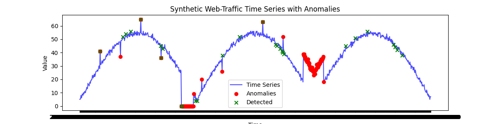
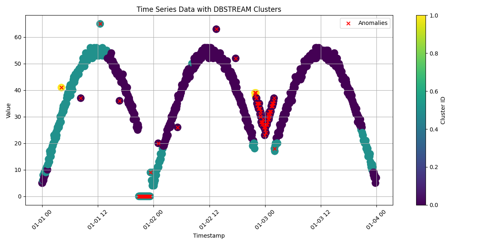

# 🧪 Evaluation of DBSCAN Clustering Technique on Time Series Data with Anomalies

## ✏️ Problem Statement

An implemented monitoring solution that uses Random Cut Forest (RCF) is experiencing high-false discovery rate (approximately 40%). This results in more operational overhead without improving system reliability. This also resulted in alert-desynsitization which further led to critical incidents being missed due to alerts being buried under false-positive narrative.

This projects aims to evaluate a promising tool that uses Density-Based Spatial Clustering of Application with Noise (DBSCAN) to increase alerting precision without sacrificing recall.

## ⚙️Setup Instructions

This project was created largely on Google Collab. Dependency Installation is also included in the notebooks.

Upload the `data` and `src` directories on the `/` (slash) directory if using Google Collab as well

## 📝 Results Summary

Comparing a anomaly detection algorithm to a clustering one is unorthodoxical and therefore cannot be compared by standard tools. In conclusion, streamed DBSCAN shows promising attributes in detecting anomalous data by monitoring streamed data. 

### RRCF

### DBSCAN
